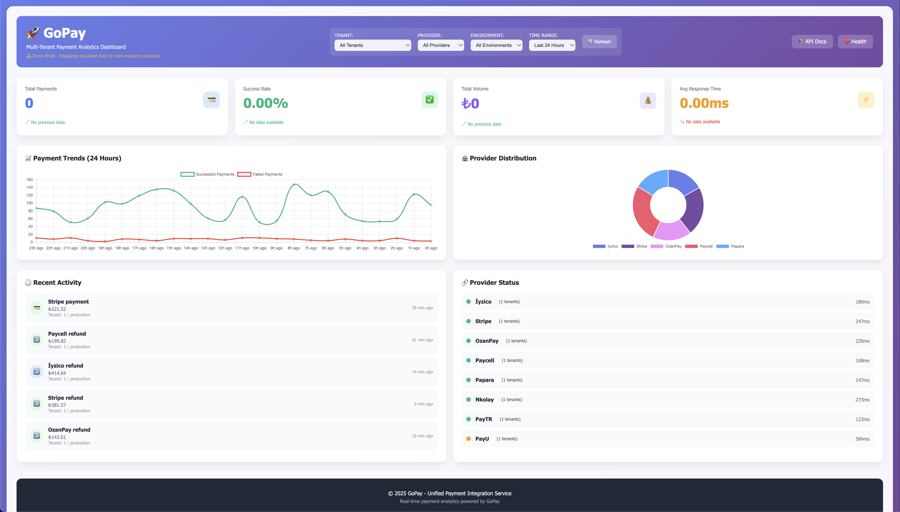

# GoPay

## 🚀 Unified Payment Gateway Service

GoPay is a centralized payment gateway that standardizes multiple payment providers behind a single API. It eliminates the complexity of integrating with different payment systems by providing a unified interface for all payment operations.

## 🎯 Core Purpose

**Problem:** Every payment provider has different APIs, authentication methods, callback mechanisms, and response formats.

**Solution:** GoPay standardizes everything into one consistent interface with multi-tenant support.

```
┌─────────────────┐    ┌─────────────────┐    ┌─────────────────┐
│                 │    │                 │    │                 │
│   Your Apps     │◄──►│     GoPay       │◄──►│   Payment       │
│  (Multi-Tenant) │    │   (Gateway)     │    │   Providers     │
│                 │    │                 │    │                 │
└─────────────────┘    └─────────────────┘    └─────────────────┘
```

## 🏗️ Architecture

### JWT-Based Multi-Tenant System

- **Authentication**: JWT tokens with auto-rotating secret keys
- **Multi-Tenant**: Each tenant has isolated provider configurations
- **Database**: PostgreSQL for configurations, logging, and analytics
- **Rate Limiting**: Tenant-specific rate limits with burst allowance
- **Security**: Auto-rotating JWT secrets, input validation, audit logging

### Payment Flow

1. **Authenticate** → Get JWT token
2. **Configure** → Set provider credentials (tenant-specific)
3. **Process** → Create payments using standardized API
4. **Handle** → Manage callbacks, webhooks, and responses
5. **Monitor** → Track transactions and analytics

## 🏪 Supported Payment Providers

| Provider    | Status        | Region | Features                    |
| ----------- | ------------- | ------ | --------------------------- |
| **İyzico**  | ✅ Production | Turkey | Payment, 3D, Refund, Cancel |
| **Stripe**  | ✅ Production | Global | Payment, 3D, Refund, Cancel |
| **OzanPay** | ✅ Production | Turkey | Payment, 3D, Refund, Cancel |
| **Paycell** | ✅ Production | Turkey | Payment, 3D, Refund, Cancel |
| **Papara**  | ✅ Production | Turkey | Payment, 3D, Refund, Cancel |
| **Nkolay**  | ✅ Production | Turkey | Payment, 3D, Refund, Cancel |
| **PayTR**   | ✅ Production | Turkey | Payment, 3D, Refund, Cancel |
| **PayU**    | ✅ Production | Global | Payment, 3D, Refund, Cancel |

## 🚦 Quick Start

### 1. Installation & Setup

```bash
git clone https://github.com/mstgnz/gopay.git
cd gopay

# Configure environment
cp .env.example .env
# Edit .env with your database settings

# Run with Docker
docker-compose up -d

# Or run directly
go run ./cmd/main.go
```

### 2. Authentication

```bash
# First user registration (becomes admin)
curl -X POST http://localhost:9999/v1/auth/register \
  -H "Content-Type: application/json" \
  -d '{
    "username": "admin",
    "password": "securepassword123"
  }'

# Login to get JWT token
curl -X POST http://localhost:9999/v1/auth/login \
  -H "Content-Type: application/json" \
  -d '{
    "username": "admin",
    "password": "securepassword123"
  }'
```

### 3. Configure Provider

```bash
# Configure payment provider (tenant-specific)
curl -X POST http://localhost:9999/v1/config/tenant \
  -H "Authorization: Bearer YOUR_JWT_TOKEN" \
  -H "Content-Type: application/json" \
  -d '{
    "provider": "iyzico",
    "environment": "test",
    "configs": [
      {"key": "apiKey", "value": "your-api-key"},
      {"key": "secretKey", "value": "your-secret-key"}
    ]
  }'
```

### 4. Process Payment

```bash
# Create payment
curl -X POST http://localhost:9999/v1/payments/iyzico \
  -H "Authorization: Bearer YOUR_JWT_TOKEN" \
  -H "Content-Type: application/json" \
  -d '{
    "amount": 100.50,
    "currency": "TRY",
    "customer": {
      "name": "John",
      "surname": "Doe",
      "email": "john@example.com"
    },
    "cardInfo": {
      "cardHolderName": "John Doe",
      "cardNumber": "5528790000000008",
      "expireMonth": "12",
      "expireYear": "2030",
      "cvv": "123"
    },
    "use3D": true,
    "callbackUrl": "https://yourapp.com/callback"
  }'
```

## 🔐 Security Features

### JWT Authentication

- **Auto-Rotating Secret Keys**: JWT secret regenerates on service restart
- **Token Expiry**: 24-hour token lifetime with refresh capability
- **Tenant Isolation**: Each tenant has separate configurations and data

### Rate Limiting

- **Tenant-Based**: Individual limits per tenant
- **Action-Specific**: Different limits for payment, refund, status checks
- **Burst Allowance**: Additional requests above base limits
- **IP Protection**: Rate limiting for unauthenticated requests

### Data Protection

- **Input Validation**: Comprehensive request validation
- **SQL Injection Protection**: Parameterized queries
- **Audit Logging**: All operations logged with tenant isolation
- **Sensitive Data Masking**: Card numbers and keys masked in logs

## 📊 Key Features

### Multi-Tenant Support

- **Tenant Isolation**: Complete separation of configurations and data
- **JWT-Based**: Tenant information embedded in authentication tokens
- **Scalable**: Support for unlimited tenants with isolated rate limits

### Payment Operations

- **Standard Payments**: Direct card payments
- **3D Secure**: Enhanced security with bank authentication
- **Refunds**: Full and partial refund support
- **Status Tracking**: Real-time payment status monitoring
- **Cancellations**: Payment cancellation support

### Monitoring & Analytics

- **Real-Time Dashboard**: Payment statistics and performance metrics
- **Provider Analytics**: Success rates and error tracking per provider
- **Activity Logs**: Complete audit trail with tenant isolation
- **PostgreSQL Integration**: Structured logging and analytics

## 🛠️ API Endpoints

### Authentication

```
POST /v1/auth/login          # User login
POST /v1/auth/register       # First user registration
POST /v1/auth/create-tenant  # Create new tenant (admin only)
POST /v1/auth/refresh        # Refresh JWT token
```

### Configuration

```
POST /v1/config/tenant       # Configure payment provider
GET  /v1/config/tenant       # Get tenant configuration
DELETE /v1/config/tenant     # Delete tenant configuration
```

### Payments

```
POST /v1/payments/{provider}                 # Create payment
GET  /v1/payments/{provider}/{paymentID}     # Check payment status
DELETE /v1/payments/{provider}/{paymentID}   # Cancel payment
POST /v1/payments/{provider}/refund          # Process refund
```

### Monitoring

```
GET /v1/analytics/dashboard  # Dashboard statistics
GET /v1/logs/{provider}      # Payment logs
GET /health                  # Health check
```

## 📚 Documentation

- **🌐 API Documentation**: [Interactive API Docs](http://localhost:9999/docs)
- **📖 Provider Guides**: Individual provider documentation in `provider/*/README.md`
- **🔧 Examples**: Complete examples in `examples/` directory
- **🎯 Postman Collections**: Available in each provider directory

## 🐳 Deployment

### Docker (Recommended)

```bash
docker-compose up -d
```

### Kubernetes

```bash
kubectl apply -f k8s/
```

### Manual Deployment

```bash
# Build binary
go build -o gopay ./cmd/main.go

# Run with PostgreSQL
./gopay
```

## 🔧 Environment Variables

```bash
# Database
DB_HOST=localhost
DB_PORT=5432
DB_NAME=gopay
DB_USER=postgres
DB_PASSWORD=password

# Application
APP_PORT=9999
APP_URL=http://localhost:9999
SECRET_KEY=your-secret-key

# Rate Limiting
TENANT_GLOBAL_RATE_LIMIT=100
TENANT_PAYMENT_RATE_LIMIT=50
TENANT_REFUND_RATE_LIMIT=20
```

## 🤝 Contributing

1. Fork the repository
2. Create a feature branch
3. Add tests for your changes
4. Submit a pull request

### Adding New Providers

1. Implement the `provider.PaymentProvider` interface
2. Add provider package under `provider/{provider}/`
3. Create comprehensive README and tests
4. Register provider in `provider/{provider}/register.go`

## 📄 License

This project is licensed under the [Boost Software License 1.0](./LICENSE).

## 🆘 Support

- **📖 Documentation**: [API Docs](http://localhost:9999/docs)
- **🐛 Issues**: [GitHub Issues](https://github.com/mstgnz/gopay/issues)
- **💡 Discussions**: [GitHub Discussions](https://github.com/mstgnz/gopay/discussions)

---

**🚀 Ready to integrate payments?** Start with the [API documentation](http://localhost:9999/docs) or check out the [examples](examples/)!


