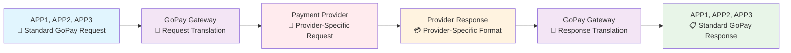
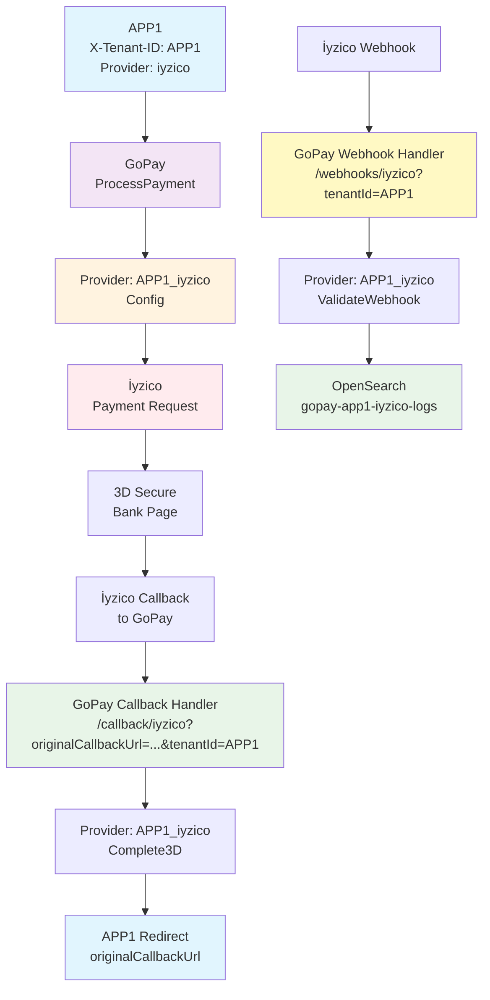

# GoPay

## 🚀 Unified Payment Integration Service

GoPay is a centralized payment gateway that abstracts multiple payment providers behind a single, standardized API. It acts as a bridge between your applications and payment providers, handling callbacks, webhooks, and logging seamlessly.

## 🎯 Why GoPay?

**Problem:** Every payment provider has different APIs, authentication methods, callback mechanisms, and response formats.

**Solution:** GoPay standardizes everything into one consistent interface.

```
┌─────────────────┐    ┌─────────────────┐    ┌─────────────────┐
│                 │    │                 │    │                 │
│   Your Apps     │◄──►│     GoPay       │◄──►│   Payment       │
│  (APP1, APP2)   │    │   (Gateway)     │    │   Providers     │
│                 │    │                 │    │                 │
└─────────────────┘    └─────────────────┘    └─────────────────┘
```

## 🔄 Payment Flow & Architecture

### 🔄 **Basic Request-Response Flow**

GoPay acts as a standardized gateway between your applications and payment providers:



**Flow Explanation:**

1. **APP1** initiates payment → sends **standard GoPay request**
2. **GoPay** receives request → **translates to provider-specific format**
3. **GoPay** sends request → **provider processes payment**
4. **Provider** sends response → **GoPay receives provider response**
5. **GoPay** translates response → **returns standard GoPay response** to **APP1**

### 🔐 **Complete 3D Secure Flow**

For payments requiring 3D Secure authentication:



### 📋 Complete Payment Flow Steps:

1. **Application** sends payment request to **GoPay** with `X-Tenant-ID` header
2. **GoPay** translates standard request to provider-specific format
3. **GoPay** forwards request to chosen **Provider** using tenant-specific configuration
4. **Provider** returns response (direct payment or 3D Secure URL)
5. **For 3D Secure**: User completes authentication on provider's page
6. **Provider** sends callback to **GoPay** with payment result
7. **GoPay** processes callback and redirects user back to **Application**
8. **Provider** sends webhook to **GoPay** for final confirmation
9. **GoPay** logs everything to **OpenSearch** in tenant-specific indexes

## 🌟 Core Capabilities

### 🏗️ **Multi-Tenant Architecture**

- **Tenant Isolation**: Each application uses separate provider configurations
- **Flexible Routing**: Support for multiple apps with different providers
- **Secure Separation**: Complete data isolation between tenants

### 🔄 **Environment Support**

- **Sandbox/Production**: Each provider supports both test and live environments
- **Dynamic Switching**: Different tenants can use different environments
- **Configuration Management**: Runtime configuration updates

### 🛡️ **Security & Reliability**

- **API Authentication**: Bearer token security
- **Rate Limiting**: Configurable limits per tenant/endpoint
- **IP Whitelisting**: Additional security layer
- **Webhook Validation**: Cryptographic verification of provider notifications

### 📊 **Monitoring & Analytics**

- **Real-time Logging**: OpenSearch integration for comprehensive tracking
- **Performance Metrics**: Provider-specific analytics
- **Dashboard**: Web-based monitoring interface
- **Audit Trails**: Complete request/response logging

## 🏪 Supported Payment Providers

| Provider    | Status         | Documentation                       | Features                    |
| ----------- | -------------- | ----------------------------------- | --------------------------- |
| **İyzico**  | ✅ Production  | [Guide](provider/iyzico/README.md)  | Payment, 3D, Refund, Cancel |
| **Stripe**  | 🚧 Development | [Guide](provider/stripe/README.md)  | Payment, 3D, Refund, Cancel |
| **OzanPay** | ✅ Production  | [Guide](provider/ozanpay/README.md) | Payment, 3D, Refund, Cancel |
| **Paycell** | ✅ Production  | [Guide](provider/paycell/README.md) | Payment, 3D, Refund, Cancel |
| **Papara**  | 🚧 Development | [Guide](provider/papara/README.md)  | Payment, 3D, Refund, Cancel |
| **Nkolay**  | 🚧 Development | [Guide](provider/nkolay/README.md)  | Payment, 3D, Refund, Cancel |
| **PayTR**   | 🚧 Development | [Guide](provider/paytr/README.md)   | Payment, 3D, Refund, Cancel |
| **PayU**    | 🚧 Development | [Guide](provider/payu/README.md)    | Payment, 3D, Refund, Cancel |
| **Shopier** | 🚧 Development | [Guide](provider/shopier/README.md) | Coming Soon                 |

## 🚦 Quick Start

### 1. **Installation**

```bash
git clone https://github.com/mstgnz/gopay.git
cd gopay

# Configure environment
cp .env.example .env
# Edit .env with your settings
```

### 2. **Configuration**

Set your environment variables:

```bash
# Core settings
API_KEY=your_super_secret_api_key
APP_URL=https://your-gopay-domain.com

# OpenSearch logging (optional)
OPENSEARCH_URL=http://localhost:9200
ENABLE_OPENSEARCH_LOGGING=true

# Provider credentials (example for İyzico)
IYZICO_API_KEY=your_iyzico_api_key
IYZICO_SECRET_KEY=your_iyzico_secret_key
IYZICO_ENVIRONMENT=sandbox
```

### 3. **Run Service**

```bash
# Using Docker (Recommended)
docker-compose up -d

# Or directly with Go
go run ./cmd/main.go

# Service will be available at http://localhost:9999
```

## 📡 API Endpoints

### 🔐 **Authenticated Endpoints**

```bash
# Payment Operations
POST   /v1/payments/{provider}              # Create payment
GET    /v1/payments/{provider}/{paymentID}  # Check status
DELETE /v1/payments/{provider}/{paymentID}  # Cancel payment
POST   /v1/payments/{provider}/refund       # Process refund

# Configuration Management
POST   /v1/set-env                          # Set tenant config
GET    /v1/config/tenant-config             # Get tenant config
DELETE /v1/config/tenant-config             # Delete tenant config

# Analytics & Monitoring
GET    /v1/analytics/dashboard              # Dashboard stats
GET    /v1/analytics/providers              # Provider stats
GET    /v1/logs/{provider}                  # Payment logs
GET    /v1/stats                           # General statistics
```

### 🌐 **Public Endpoints** (No Authentication)

```bash
# Callbacks & Webhooks
POST   /callback/{provider}                 # 3D Secure callbacks
GET    /callback/{provider}                 # 3D Secure callbacks
POST   /webhooks/{provider}                 # Payment webhooks

# System
GET    /health                              # Health check
GET    /                                    # Analytics dashboard
GET    /docs                                # API documentation
```

## 💻 Usage Examples & Integration

Comprehensive examples and integration guides are available:

### 📁 **Examples Directory**

- **[Main Examples](examples/README.md)** - Complete integration examples
- **[İyzico Example](examples/iyzico_example.go)** - Go integration example
- **[Multi-Tenant Setup](examples/multi_tenant/)** - Multi-tenant examples
- **[cURL Examples](examples/)** - HTTP API examples for each provider

### 🔧 **Provider-Specific Examples**

- **[İyzico cURL Examples](examples/iyzico_curl_examples.sh)**
- **[OzanPay cURL Examples](examples/ozanpay_curl_examples.sh)**
- **[Paycell cURL Examples](examples/paycell_curl_examples.sh)**
- **[Papara cURL Examples](examples/papara_curl_examples.sh)**
- **[Multi-Tenant Setup Script](examples/multi_tenant_setup.sh)**

## 🏗️ Development & Deployment

### **Environment Setup**

```bash
# Install dependencies
go mod tidy

# Run tests
go test ./...

# Build binary
go build -o gopay ./cmd/main.go
```

### **Docker Deployment**

```bash
# Build and run with Docker Compose
docker-compose up -d

# Or build custom image
docker build -t gopay .
docker run -p 9999:9999 gopay
```

### **Kubernetes Deployment**

```bash
# Apply Kubernetes manifests
kubectl apply -f k8s/
```

## 📚 Documentation

- **🌐 API Documentation**: [Scalar UI](http://localhost:9999/docs) - Interactive API documentation
- **📖 Go Documentation**: Run `pkgsite -http=localhost:8081 .` for comprehensive Go package docs
- **📝 Provider Guides**: Individual provider documentation in `provider/*/README.md`
- **🔧 Examples**: Complete integration examples in [examples/](examples/)

## 🔒 Security Features

- **🔐 API Key Authentication** with Bearer tokens
- **🛡️ Rate Limiting** (configurable per endpoint)
- **🚨 IP Whitelisting** support
- **🔍 Request Validation** and size limits
- **📊 Audit Logging** for all operations
- **🔐 Webhook Signature Validation**

## 📊 Monitoring & Analytics

- **📈 Real-time Dashboard** at http://localhost:9999
- **🔍 OpenSearch Integration** for advanced analytics
- **📋 Structured Logging** with tenant isolation
- **⚡ Performance Metrics** per provider
- **🎯 Success/Error Rate Tracking**

## 🤝 Contributing

We welcome contributions! Please see our contributing guidelines:

1. **Fork** the repository
2. **Create** a feature branch (`git checkout -b feature/new-provider`)
3. **Add tests** for your changes
4. **Submit** a pull request

### **Adding New Providers**

1. Implement the `provider.PaymentProvider` interface
2. Add provider package under `provider/{provider}/`
3. Create comprehensive README and tests
4. Register the provider in `provider/{provider}/register.go`

## 📄 License

This project uses a **dual license** approach:

### 🏗️ **Full Project License (MPL 2.0)**

- **File**: [LICENSE](LICENSE) - Mozilla Public License 2.0
- **Applies to**: Complete project, forks, distributions
- ✅ **Free to use** in personal and commercial projects
- ✅ **Contributions welcome** via pull requests
- ✅ **Modification allowed** with same license requirements
- ❌ **Redistribution** must maintain MPL 2.0 license
- ❌ **Proprietary forks** are not permitted

## 🆘 Support

- **📖 Documentation**: Check the docs links above
- **🐛 Bug Reports**: [GitHub Issues](https://github.com/mstgnz/gopay/issues)
- **❓ Questions**: Create an issue for questions and help
- **💡 Feature Requests**: Submit via GitHub Issues

---

**🚀 Ready to integrate payments?** Start with the [examples](examples/) or check the [API documentation](http://localhost:9999/docs)!
