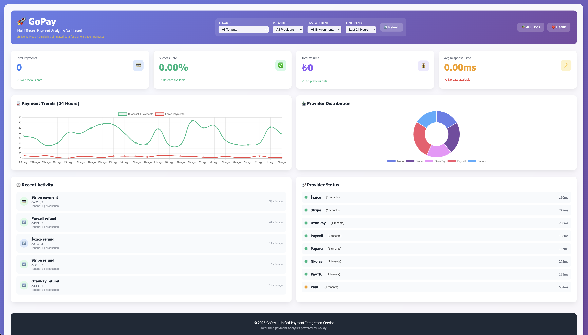

# GoPay

## 🚀 Unified Payment Gateway Service

GoPay is a centralized payment gateway that standardizes multiple payment providers behind a single API. It eliminates the complexity of integrating with different payment systems by providing a unified interface for all payment operations.

## 🎯 Core Purpose

**Problem:** Every payment provider has different APIs, authentication methods, callback mechanisms, and response formats.

**Solution:** GoPay standardizes everything into one consistent interface with multi-tenant support.

```
┌─────────────────┐    ┌─────────────────┐    ┌─────────────────┐
│                 │    │                 │    │                 │
│   Your Apps     │◄──►│     GoPay       │◄──►│   Payment       │
│  (Multi-Tenant) │    │   (Gateway)     │    │   Providers     │
│                 │    │                 │    │                 │
└─────────────────┘    └─────────────────┘    └─────────────────┘
```

## 🏗️ Architecture

### JWT-Based Multi-Tenant System

- **Authentication**: JWT tokens signed with `JWT_SECRET`, revoked by a password change
- **Multi-Tenant**: Each tenant has isolated provider configurations
- **Database**: PostgreSQL for configurations, logging, and analytics
- **Rate Limiting**: Tenant-specific rate limits with burst allowance
- **Security**: Token revocation, login throttling, masked credentials, input validation, audit logging

### Payment Flows

#### 🔄 **Standard Operations (Payment, Refund, Cancel)**

```
┌─────────────┐    ┌─────────────┐    ┌─────────────┐
│             │    │             │    │             │
│   Your App  │───►│   GoPay     │───►│  Provider   │
│             │    │             │    │             │
│             │◄───│             │◄───│             │
└─────────────┘    └─────────────┘    └─────────────┘
     │                    │                    │
     │                    │                    │
     ▼                    ▼                    ▼
1. Send request      2. Forward to        3. Process &
   with JWT             provider             respond
```

**Direct API flow for payments, refunds, and cancellations.**

#### 🔐 **3D Secure Payment Flow (Detailed)**

**Phase 1: Payment Initialization**

```
1. [App] ──POST /payments/provider──► [GoPay]
   │ Request: { amount, cardInfo, callbackUrl: "app.com/callback" }
   │
   └─► [GoPay] ──► [Provider]
       │ Modified: { callbackUrl: "gopay.com/v1/callback/provider?originalCallbackUrl=app.com/callback" }
       │
       └─► Response: { redirectUrl: "provider-3d-secure-link" }
```

**Phase 2: User Redirect**

```
2. [GoPay] ──Response──► [App]
   │ Returns: { redirectUrl: "provider-3d-secure-link" }
   │
   └─► [App] redirects user to payment page
       │
       └─► User goes to [Provider 3D Secure Page]
```

**Phase 3: 3D Secure Process**

```
3. [User] completes 3D authentication on provider page
   ├─► Enter SMS code
   ├─► Bank authentication
   └─► Payment confirmation
```

**Phase 4: Callback Handling**

```
4. [Provider] ──Callback──► [GoPay]
   │ URL: gopay.com/v1/callback/provider?originalCallbackUrl=app.com/callback
   │ Data: { paymentId, status, transactionId }
   │
   └─► [GoPay] processes result
       │
       └─► [GoPay] ──Redirect──► [App]
           │ URL: app.com/callback?success=true&paymentId=123&status=successful
           │
           └─► [App] shows success/failure page to user
```

**Complete 3D Secure Flow:**

```
[Your App] → [GoPay] → [Provider] → [3D Page] → [Provider] → [GoPay] → [Your App]
    │           │          │           │          │           │          │
    │           │          │           │          │           │          │
    ▼           ▼          ▼           ▼          ▼           ▼          ▼
1. Payment   2. Forward  3. Return   4. User    5. Callback 6. Process  7. Final
   request      with       3D link     auth       to GoPay    & redirect   result
               callback
```

#### 🔧 **Setup Flow**

1. **Authenticate** → Get JWT token (`POST /v1/auth/login`)
2. **Configure** → Admin sets the tenant's provider credentials (`POST /v1/config/tenant`, admin only)
3. **Process** → Create payments using standardized API
4. **Handle** → Automatic callback/webhook management
5. **Monitor** → Track transactions via dashboard & logs

## 🏪 Supported Payment Providers

| Provider    | Status      | Region | Features                    |
| ----------- | ----------- | ------ | --------------------------- |
| **Paycell** | Production  | Turkey | Payment, 3D, Refund, Cancel |
| **Nkolay**  | Production  | Turkey | Payment, 3D, Refund, Cancel |
| **Akbank**  | Production  | Turkey | Payment, 3D, Refund, Cancel |
| **İyzico**  | Development | Turkey | Payment, 3D, Refund, Cancel |
| **OzanPay** | Development | Turkey | Payment, 3D, Refund, Cancel |
| **Papara**  | Development | Turkey | Payment, 3D, Refund, Cancel |
| **PayTR**   | Development | Turkey | Payment, 3D, Refund, Cancel |
| **PayU**    | Development | Global | Payment, 3D, Refund, Cancel |
| **Stripe**  | Development | Global | Payment, 3D, Refund, Cancel |

## 🚦 Quick Start

### 1. Installation & Setup

```bash
git clone https://github.com/mstgnz/gopay.git
cd gopay

# Configure environment
cp .env.example .env
# Edit .env with your database settings and set JWT_SECRET (openssl rand -base64 48)

# Run with Docker
docker-compose up -d

# Or run directly
go run ./cmd/main.go
```

### 2. Authentication

```bash
# First user registration (becomes admin)
curl -X POST http://localhost:9999/v1/auth/register \
  -H "Content-Type: application/json" \
  -d '{
    "username": "admin",
    "password": "securepassword123"
  }'

# Login to get JWT token
curl -X POST http://localhost:9999/v1/auth/login \
  -H "Content-Type: application/json" \
  -d '{
    "username": "admin",
    "password": "securepassword123"
  }'
```

### 3. Configure Provider

```bash
# Configure payment provider for a tenant (admin token only; omit tenantId for the admin itself)
curl -X POST http://localhost:9999/v1/config/tenant \
  -H "Authorization: Bearer ADMIN_JWT_TOKEN" \
  -H "Content-Type: application/json" \
  -d '{
    "tenantId": 2,
    "provider": "iyzico",
    "environment": "sandbox",
    "configs": [
      {"key": "apiKey", "value": "your-api-key"},
      {"key": "secretKey", "value": "your-secret-key"}
    ]
  }'
```

### 4. Process Payments

#### 💳 **Standard Payment (Direct)**

```bash
# Create direct payment (no 3D Secure)
curl -X POST http://localhost:9999/v1/payments/iyzico \
  -H "Authorization: Bearer YOUR_JWT_TOKEN" \
  -H "Content-Type: application/json" \
  -d '{
    "amount": 100.50,
    "currency": "TRY",
    "customer": {
      "name": "John",
      "surname": "Doe",
      "email": "john@example.com"
    },
    "cardInfo": {
      "cardHolderName": "John Doe",
      "cardNumber": "5528790000000008",
      "expireMonth": "12",
      "expireYear": "2030",
      "cvv": "123"
    },
    "use3D": false
  }'

# Response
{
  "success": true,
  "status": "successful",
  "paymentId": "12345",
  "transactionId": "67890",
  "amount": 100.50,
  "currency": "TRY"
}
```

#### 🔐 **3D Secure Payment (Step-by-Step)**

```bash
# Step 1: Initialize 3D Secure payment
curl -X POST http://localhost:9999/v1/payments/iyzico \
  -H "Authorization: Bearer YOUR_JWT_TOKEN" \
  -H "Content-Type: application/json" \
  -d '{
    "amount": 100.50,
    "currency": "TRY",
    "customer": {
      "name": "John",
      "surname": "Doe",
      "email": "john@example.com"
    },
    "cardInfo": {
      "cardHolderName": "John Doe",
      "cardNumber": "5528790000000008",
      "expireMonth": "12",
      "expireYear": "2030",
      "cvv": "123"
    },
    "use3D": true,
    "callbackUrl": "https://yourapp.com/payment-callback"
  }'

# Step 1 Response: You get redirect URL
{
  "success": true,
  "status": "pending",
  "paymentId": "12345",
  "redirectUrl": "https://provider-3dsecure.com/auth?token=xyz",
  "message": "3D Secure authentication required"
}
```

**3D Secure Flow Implementation:**

```php
<?php
// Step 2: Your app redirects user to 3D page
session_start();
$_SESSION['payment_id'] = $paymentId; // Store for later

header("Location: " . $redirectUrl); // User goes to bank page
?>
```

```php
<?php
// Step 3: Handle callback (yourapp.com/payment-callback)
session_start();

if($_GET['success'] === 'true') {
    $paymentId = $_GET['paymentId'];
    $status = $_GET['status'];
    $transactionId = $_GET['transactionId'];

    // Payment successful - redirect to success page
    header("Location: /payment-success?payment=" . $paymentId);
} else {
    $error = $_GET['error'];
    // Payment failed - redirect to error page
    header("Location: /payment-failed?error=" . urlencode($error));
}
?>
```

**Complete 3D Flow:**

1. **Your App** → Send payment request → **GoPay**
2. **GoPay** → Get `redirectUrl` → **Your App**
3. **Your App** → Redirect user → **Provider 3D Page**
4. **User** → Complete 3D auth → **Provider**
5. **Provider** → Callback → **GoPay** → **Your App**
6. **Your App** → Show result page → **User**

## 🔐 Security Features

### JWT Authentication

- **Signing Key**: `JWT_SECRET` (32+ random characters); the server refuses to start without it, and rotating it invalidates every token
- **Token Expiry**: 12-hour tokens; refresh never extends a session past 24 hours after login
- **Tenant Isolation**: Each tenant has separate configurations and data

### Rate Limiting

- **Tenant-Based**: Individual limits per tenant
- **Action-Specific**: Different limits for payment, refund, status checks
- **Burst Allowance**: Additional requests above base limits
- **IP Protection**: Rate limiting for unauthenticated requests

### Data Protection

- **Input Validation**: Comprehensive request validation
- **SQL Injection Protection**: Parameterized queries
- **Audit Logging**: All operations logged with tenant isolation
- **Sensitive Data Masking**: Card numbers and keys masked in logs

## 📊 Key Features

### Multi-Tenant Support

- **Tenant Isolation**: Complete separation of configurations and data
- **JWT-Based**: Tenant information embedded in authentication tokens
- **Scalable**: Support for unlimited tenants with isolated rate limits

### Payment Operations

- **Standard Payments**: Direct card payments
- **3D Secure**: Enhanced security with bank authentication
- **Refunds**: Full and partial refund support
- **Status Tracking**: Real-time payment status monitoring
- **Cancellations**: Payment cancellation support

### Monitoring & Analytics

- **Real-Time Dashboard**: Payment statistics and performance metrics
- **Provider Analytics**: Success rates and error tracking per provider
- **Activity Logs**: Complete audit trail with tenant isolation
- **PostgreSQL Integration**: Structured logging and analytics

## 🛠️ API Endpoints

### Authentication

```
POST /v1/auth/login          # User login
POST /v1/auth/register       # First user registration
POST /v1/auth/create-tenant  # Create new tenant (admin only)
POST /v1/auth/refresh        # Refresh JWT token (the session ends 24h after the original login)
```

A token is bound to the password it was issued under: changing the password revokes every
earlier token. Repeated failed logins for a username from one client IP within 15 minutes
return `429` for that IP only; logins from other IPs are unaffected.

### Configuration

```
POST /v1/config/tenant       # Configure payment provider (admin only, optional tenantId)
GET  /v1/config/tenant       # Get tenant configuration (values masked)
DELETE /v1/config/tenant     # Delete tenant configuration (admin only, optional tenant_id)
```

### Payments

```
POST /v1/payments/{provider}                 # Create payment
GET  /v1/payments/{provider}/{paymentID}     # Check payment status
DELETE /v1/payments/{provider}/{paymentID}   # Cancel payment
POST /v1/payments/{provider}/refund          # Process refund
```

### Callbacks & Webhooks (Provider → GoPay → Your App)

```
# 3D Secure Callbacks (Automatic - Provider calls these)
GET|POST /v1/callback/{provider}             # 3D Secure completion callback
Parameters: ?originalCallbackUrl=yourapp.com/callback&paymentId=123&status=success

# Payment Webhooks (Automatic - Provider notifications)
POST /v1/webhooks/{provider}                 # Payment status notifications
```

**Callback Flow:**

- Provider redirects user to: `gopay.com/v1/callback/iyzico?originalCallbackUrl=yourapp.com/callback`
- GoPay processes and redirects to: `yourapp.com/callback?success=true&paymentId=123&status=successful`

**You don't call these endpoints directly - they're called by payment providers.**

### Monitoring

```
GET /v1/analytics/dashboard  # Dashboard statistics
GET /v1/logs/{provider}      # Payment logs
GET /health                  # Health check
```

## 📚 Documentation

- **🌐 API Documentation**: [Interactive API Docs](http://localhost:9999/docs)
- **📖 Provider Guides**: Individual provider documentation in `provider/*/README.md`
- **🔧 Examples**: Complete examples in `examples/` directory
- **🎯 Postman Collections**: Available in each provider directory

## 🐳 Deployment

### Docker (Recommended)

```bash
docker-compose up -d
```

### Kubernetes

```bash
kubectl apply -f k8s/
```

### Manual Deployment

```bash
# Build binary
go build -o gopay ./cmd/main.go

# Run with PostgreSQL
./gopay
```

## 🔧 Environment Variables

```bash
# Database
DB_HOST=localhost
DB_PORT=5432
DB_NAME=gopay
DB_USER=postgres
DB_PASSWORD=password

# Application
APP_PORT=9999
APP_URL=http://localhost:9999
SECRET_KEY=your-secret-key

# Rate Limiting
TENANT_GLOBAL_RATE_LIMIT=100
TENANT_PAYMENT_RATE_LIMIT=50
TENANT_REFUND_RATE_LIMIT=20
```

## 🤝 Contributing

1. Fork the repository
2. Create a feature branch
3. Add tests for your changes
4. Submit a pull request

### Adding New Providers

1. Implement the `provider.PaymentProvider` interface
2. Add provider package under `provider/{provider}/`
3. Create comprehensive README and tests
4. Register provider in `provider/{provider}/register.go`

## 📄 License

This project is licensed under the [Boost Software License 1.0](./LICENSE).

## 🆘 Support

- **📖 Documentation**: [API Docs](http://localhost:9999/docs)
- **🐛 Issues**: [GitHub Issues](https://github.com/mstgnz/gopay/issues)
- **💡 Discussions**: [GitHub Discussions](https://github.com/mstgnz/gopay/discussions)

---

**🚀 Ready to integrate payments?** Start with the [API documentation](http://localhost:9999/docs) or check out the [examples](examples/)!


