# GoPay

## 🚀 Unified Payment Integration Service

GoPay is a centralized payment gateway that abstracts multiple payment providers behind a single, standardized API. It acts as a bridge between your applications and payment providers, handling callbacks, webhooks, and logging seamlessly.

## 🎯 Why GoPay?

**Problem:** Every payment provider has different APIs, authentication methods, callback mechanisms, and response formats.

**Solution:** GoPay standardizes everything into one consistent interface.

```
┌─────────────────┐    ┌─────────────────┐    ┌─────────────────┐
│                 │    │                 │    │                 │
│   Your Apps     │◄──►│     GoPay       │◄──►│   Payment       │
│  (APP1, APP2)   │    │   (Gateway)     │    │   Providers     │
│                 │    │                 │    │                 │
└─────────────────┘    └─────────────────┘    └─────────────────┘
```

## 🔄 Payment Flow & Architecture

```mermaid
graph TD
    A["App1<br/>Payment Request"] --> B["GoPay<br/>/v1/payments/{provider}"]
    B --> C["Provider<br/>(İyzico, Stripe, etc.)"]
    C --> D["3D Secure<br/>Authentication"]
    D --> E["Provider Callback<br/>to GoPay"]
    E --> F["GoPay Callback Handler<br/>/callback/{provider}"]
    F --> G["App1 Redirect<br/>originalCallbackUrl"]

    H["Provider<br/>Webhook"] --> I["GoPay Webhook Handler<br/>/webhooks/{provider}"]
    I --> J["OpenSearch<br/>Logging"]

    style A fill:#e1f5fe
    style B fill:#f3e5f5
    style C fill:#fff3e0
    style D fill:#ffebee
    style F fill:#e8f5e8
    style G fill:#e1f5fe
    style I fill:#fff9c4
```




### 📋 Step-by-Step Flow:

1. **App1** sends payment request to **GoPay** with `X-Tenant-ID` header
2. **GoPay** forwards request to chosen **Provider** (İyzico, Stripe, etc.) using tenant-specific configuration
3. **Provider** returns 3D Secure URL for user authentication
4. **User** completes 3D authentication on provider's page
5. **Provider** sends callback to **GoPay** with payment result (includes tenant ID in URL)
6. **GoPay** processes callback using correct tenant configuration and redirects user back to **App1**
7. **Provider** sends webhook to **GoPay** for final confirmation (includes tenant ID in URL)
8. **GoPay** logs everything to **OpenSearch** in tenant-specific indexes for analytics

### 🔧 **Multi-Tenant Enhancements:**

- ✅ **Tenant ID Preservation**: Callback and webhook URLs include `tenantId` parameter for reliable tenant identification
- ✅ **Query Parameter Priority**: Callback handlers check query parameters first, then headers for maximum reliability
- ✅ **Tenant-Specific Logging**: OpenSearch indexes are automatically organized by tenant and provider (`gopay-{tenantId}-{provider}-logs`)
- ✅ **Enhanced Security**: Each tenant's payments are completely isolated using tenant-specific provider configurations

## 🌟 Key Features

- ✅ **Single API** for multiple payment providers
- ✅ **Seamless Callbacks** - User always returns to your app
- ✅ **Webhook Handling** - Async payment notifications
- ✅ **OpenSearch Logging** - Complete request/response tracking
- ✅ **Multi-Tenant Support** - Multiple app configurations
- ✅ **3D Secure Support** - Built-in secure authentication
- ✅ **Provider Switching** - Change providers without code changes

## 🏪 Supported Providers

| Provider    | Status        | Features                    |
| ----------- | ------------- | --------------------------- |
| **İyzico**  | ✅ Production | Payment, 3D, Refund, Cancel |
| **Stripe**  | ✅ Production | Payment, 3D, Refund, Cancel |
| **OzanPay** | ✅ Production | Payment, 3D, Refund         |
| **Paycell** | ✅ Production | Payment, 3D, Refund, Cancel |
| **Papara**  | ✅ Production | Payment, 3D, Refund, Cancel |
| **Nkolay**  | ✅ Production | Payment, 3D, Refund, Cancel |
| **PayTR**   | ✅ Production | Payment, 3D, Refund, Cancel |
| **PayU**    | ✅ Production | Payment, 3D, Refund, Cancel |

## 🚦 Quick Start

### 1. **Installation & Setup**

```bash
git clone https://github.com/mstgnz/gopay.git
cd gopay

# Configure environment
cp .env.example .env
# Edit .env with your settings
```

### 2. **Configuration**

```bash
# Your API key for authentication
API_KEY=your_super_secret_api_key

# GoPay base URL for callbacks
APP_URL=https://your-gopay-domain.com

# OpenSearch logging
OPENSEARCH_URL=http://localhost:9200
ENABLE_OPENSEARCH_LOGGING=true

# Provider credentials (example)
IYZICO_API_KEY=your_iyzico_api_key
IYZICO_SECRET_KEY=your_iyzico_secret_key
IYZICO_ENVIRONMENT=sandbox
```

### 3. **Run Service**

```bash
# With Docker (Recommended)
docker-compose up -d

# Or with Go
go run ./cmd/main.go

# Service runs on http://localhost:9999
```

## 📡 API Endpoints

### Core Payment Endpoints

```bash
# Start payment
POST /v1/payments/{provider}

# Check payment status
GET /v1/payments/{provider}/{paymentID}

# Cancel payment
DELETE /v1/payments/{provider}/{paymentID}

# Process refund
POST /v1/payments/{provider}/refund
```

### Callback & Webhook Endpoints (No Auth Required)

```bash
# 3D Secure callbacks
POST /callback/{provider}
GET /callback/{provider}

# Payment webhooks
POST /webhooks/{provider}
```

### Analytics & Monitoring

```bash
# Payment logs
GET /v1/logs/{provider}

# Statistics
GET /v1/stats?provider={provider}&hours=24
```

## 💡 Usage Examples

### **Basic Payment Request**

```bash
curl -X POST https://your-gopay.domain.com/v1/payments/iyzico \
  -H "Authorization: Bearer your_api_key" \
  -H "Content-Type: application/json" \
  -d '{
    "amount": 100.50,
    "currency": "TRY",
    "callbackUrl": "https://yourapp.com/payment-callback",
    "customer": {
      "name": "John",
      "surname": "Doe",
      "email": "john@example.com"
    },
    "cardInfo": {
      "cardNumber": "5528790000000008",
      "expireMonth": "12",
      "expireYear": "2030",
      "cvv": "123"
    }
  }'
```

### **Enhanced Callback URL Structure**

**Your Sent URL:**

```
https://yourapp.com/payment-result?successUrl=https://yourapp.com/success&errorUrl=https://yourapp.com/error
```

**What GoPay Sends to Provider:**

```
https://gopay.domain.com/v1/callback/iyzico?originalCallbackUrl=https://yourapp.com/payment-result%3FsuccessUrl%3D...
```

**User Redirect After Payment:**

```bash
# Success
https://yourapp.com/success?paymentId=123&status=successful&transactionId=abc&amount=100.50

# Error
https://yourapp.com/error?error=Payment failed&errorCode=INSUFFICIENT_FUNDS
```

### **Library Usage (Go)**

```go
import (
    "github.com/mstgnz/gopay/provider"
    _ "github.com/mstgnz/gopay/provider/iyzico"
)

// Create service
paymentService := provider.NewPaymentService()

// Add provider
config := map[string]string{
    "apiKey": "your-key",
    "secretKey": "your-secret",
    "environment": "sandbox",
}
paymentService.AddProvider("iyzico", config)

// Process payment
response, err := paymentService.CreatePayment(ctx, "iyzico", paymentRequest)
```

## 📊 OpenSearch Analytics

GoPay automatically logs all payment transactions with structured data:

### **Features:**

- **Provider-specific indexing** (e.g., `gopay-iyzico-logs`)
- **Real-time analytics** and search capabilities
- **Sensitive data masking** (card numbers, API keys)
- **Performance metrics** (response times, success rates)

### **Example Analytics Query:**

```bash
# Get payment statistics
GET /v1/stats?provider=iyzico&hours=24

# Response:
{
  "total_requests": 150,
  "success_count": 142,
  "error_count": 8,
  "avg_processing_time": 245.5,
  "success_rate": 94.67
}
```

## 🔐 Security Features

- 🔒 **API Key Authentication** with Bearer tokens
- 🛡️ **Rate Limiting** (configurable per endpoint)
- 🔐 **Webhook Signature Validation**
- 📊 **Request/Response Logging** for audit trails
- 🚨 **IP Whitelisting** support
- 🔍 **Content Validation** and size limits

## 🚀 Deployment

### **Docker (Recommended)**

```bash
docker-compose up -d
```

### **Production Environment**

- Compatible with **Kubernetes**
- Supports **horizontal scaling**
- **Health check endpoints** included
- **Graceful shutdown** handling

## 🤝 Contributing

1. Fork the repository
2. Create a feature branch (`git checkout -b feature/new-provider`)
3. Add tests for your changes
4. Submit a pull request

## 📝 License

This project is licensed under the MIT License - see the [LICENSE](LICENSE) file for details.

---

**🔗 Provider Documentation:** For detailed integration guides, test cards, and provider-specific examples, check the documentation in the `provider/` directory:

- [İyzico Integration Guide](provider/iyzico/README.md)
- [Stripe Integration Guide](provider/stripe/README.md)
- [OzanPay Integration Guide](provider/ozanpay/README.md)
- [Paycell Integration Guide](provider/paycell/README.md)
- [And more...](provider/)

**Need help?** Check the [API Documentation](http://localhost:9999) or create an issue on GitHub.
