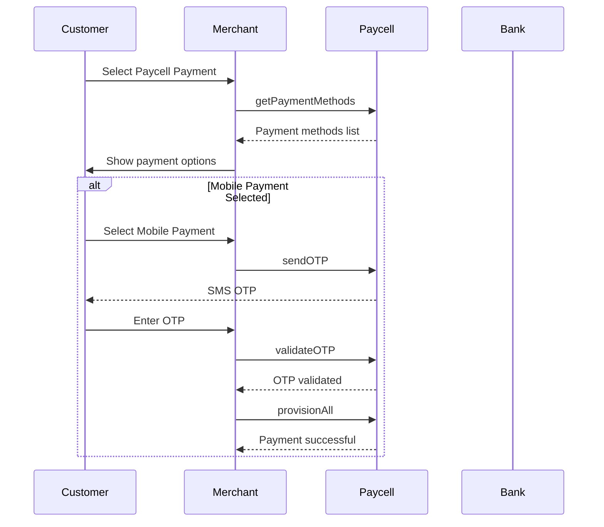

# Paycell API Documentation

## Welcome to Paycell Integration

Welcome to the Paycell world! Before starting the integration, it will be useful to review the General Features in the API Integration tab in the menu and the Function List sections for the functions you want to use.

During integration, you need to check the Important Notes for Integration and Required Definitions in the Service Access and General Information tab for critical points.

When starting integration, you should first determine the service method you will work with:

- If you will work SOAP-based, you need to look at the SOAP-Based XML Service Examples tab in the menu
- If you will work RESTFUL-based, you need to look at the RESTFUL-Based JSON Service Examples tab in the menu

If you are a PAYCELL customer, you can proceed with the test information given to you, or you can access the default information that you can use for testing from the Service Access and General Information tab.

If you will use the 3D method in transaction or card adding steps, you should examine the 3D Redirect Page title in the API Integration menu.

You can find ready-made projects written in JAVA, .NET, NODE JS, PYTHON languages on the Sample Codes page.

Throughout the entire process, you can get support from paycelldev@paycell.com.tr or from the Paycell representative you are in contact with.

**Official Documentation**: https://paycell.com.tr/paycell-api

## General Integration TEST and PREPROD Information

The values to be used in Test and Prod environments are client-specific integration information. These information need to be obtained by contacting the Paycell team.

For testing the services in this document, default integration values are given as follows. The relevant parameter values are valid for both TEST and PREPROD environments.

### Default Test Credentials

| Parameter            | Value               |
| -------------------- | ------------------- |
| Application name     | PAYCELLTEST         |
| Application password | PaycellTestPassword |
| Secure code          | PAYCELL12345        |
| Eulaid               | 17                  |
| Merchant Code        | 9998                |

## API Overview

### General Features

Paycell payment APIs provide web service interfaces that allow merchants to:

- **Process Payments**: Enable customers to make payments using their cards registered in Paycell or mobile payment methods through merchant interfaces (web, applications, etc.)
- **Payment Method Management**: Allow customers to manage their Paycell payment methods (add, delete, update cards, enable mobile payments)

### Business Model

- **Card Payments**: Merchants register their Virtual POS information from banks with Paycell to enable payment processing through Paycell to banks
- **Mobile Payments**: Enable customers to make payments by reflecting the amount to their bills using mobile payment services

### Payment Options

Payments can be processed through:

1. **Registered Cards**: Using cards already saved in Paycell
2. **Card Entry**: Customer enters card details at transaction time
3. **3D Authentication**: With or without 3D secure validation
4. **Mobile Payment**: Using mobile payment method with OTP validation

## Function Categories

Paycell API integration functions can be examined under two main categories: payment method management and payment operations. All functions or a specific portion can be included in the integration scope according to application needs and design.

**Note**: There is no customer authentication flow within the functions. It is assumed that the merchant application always performs customer authentication for the MSISDN (phone number) transmitted in the integration made by the merchant.

### Payment Method Management

#### Payment Method Query

List customer's registered payment methods (cards or mobile payment) in Paycell.

#### Card Addition

Register customer card information to Paycell.

#### Card Update

Update card's Paycell contract number, default status, and alias information.

#### Card Deletion

Delete customer's registered card information from Paycell.

#### Mobile Payment Activation

Activate customer's line for mobile payment service.

### Payment Operations

#### Payment Processing

Enable customers to make payments using:

- Registered Paycell cards
- Card details entry with/without 3D authentication
- Mobile payment reflecting amount to bill

#### Transaction Status Query

Query the status of performed transactions.

#### Cancellation

Cancel payment transactions on the same day. Mobile payments use refund instead of cancellation.

#### Refund

Cancel payment transactions from the next day onwards or refund specific amounts. Mobile payments can be refunded on the same day.

#### Reconciliation

Validate transactions between merchant and Paycell by count and amount.

## Technical Integration

### General Architecture

Paycell is positioned as a technical integrator between the merchant and the merchant's bank in payment transactions. The merchant application can also be positioned as a channel through which customers can access and manage their Paycell wallet.

### Integration Flow

1. **Backend Integration**: Merchant integrates with Paycell's "Provision" service through backend application to send transaction requests
2. **Card Token Security**: For card information transmission (e.g., card addition), the merchant application directly communicates with Paycell's "getCardTokenSecure" service over the internet to avoid passing card details through the merchant's backend server
3. **Token Usage**: The "token" value received from getCardTokenSecure service response is used as input parameter in relevant Provision service methods

### Mobile Payment Flow



#### Mobile Payment Process Details

1. **Payment Method Listing**: Merchant calls `getPaymentMethods` service to list customer's payment methods
2. **Mobile Payment Status Check**: Service returns `cardList` and `mobilePayment` information
3. **Mobile Payment Activation**: If mobile payment is closed, merchant can offer activation option via checkbox
4. **Contract Validation**: Check if customer has current mobile payment contract
5. **OTP Verification**:
   - Call `sendOTP` service for payment verification
   - Customer receives SMS with OTP
   - Call `validateOTP` service to verify entered OTP
6. **Payment Processing**: Call `provisionAll` service to complete payment
7. **Post-Payment Operations**: Use `refundAll` for refunds and `inquireAll` for transaction queries

## 3D Secure Integration

### 3D Redirect Page Implementation

For 3D secure authentication, implement the following flow:

1. **Server Side**: Get `threeDSessionId` from `getThreeDSession` service and pass to client
2. **Client Side**: Use browser to POST to Paycell's 3D secure URL
3. **Required Parameters**:
   - `threeDSessionId`: Unique identifier for 3D authentication session
   - `callbackurl`: URL where 3D authentication result will be sent

### Sample 3D Secure Form

```html
<html>
  <head>
    <title>Paycell 3D-Secure Processing Page</title>
  </head>
  <body>
    <form
      target="_blank"
      name="threeDForm"
      action="https://omccstb.turkcell.com.tr/paymentmanagement/rest/threeDSecure"
      method="POST"
    >
      <table>
        <tr>
          <td>threeDSessionId:</td>
          <td>
            <input type="text" name="threeDSessionId" value="" size="50" />
          </td>
        </tr>
        <tr>
          <td>callbackurl:</td>
          <td>
            <input type="text" name="callbackurl" value="" />
          </td>
        </tr>
        <tr>
          <td>isPost3DResult:</td>
          <td>
            <input type="text" name="isPost3DResult" value="" size="50" />
          </td>
        </tr>
        <tr>
          <td colspan="2">
            <input type="submit" name="submit" value="Send to Bank" />
          </td>
        </tr>
      </table>
    </form>

    <!-- Auto-submit form (optional)
    <script language="javascript">
        document.threeDForm.submit();
    </script>
    -->
  </body>
</html>
```

## Important Integration Notes

### Data Sharing Permissions

During first use, data sharing permissions should be obtained from the user and stored in the application for:

- Transmitting the user's MSISDN information to Paycell
- Transmitting the user's mobile payment information registered in Paycell with their registered cards to the merchant application

### MSISDN Validation

It is assumed that the MSISDN information from the application has been verified by the application. The verification method should be managed in the merchant application.

### Current User Agreement

The user agreement is kept on a card basis in Paycell. In card adding and payment operations, it should be checked whether the card used has the current version (eulaId) value. In cases where the current version needs to be confirmed, card update operations should be performed for each card.

If the mobile payment method is to be used, it should also be checked whether the user's mobile payment eulaId is current during the mobile payment opening process. If it is not current, the current contract should be signed through the link returned by the getPaymentMethods service as a response.

### Timeout Management

In payment operations, when no response is received from the provision service and the operation falls into timeout, the transaction results should be queried by the merchant and reverse/refund operations should be called.

## API Environments

### Test Environment

- **Base URL**: `https://tpay-test.turkcell.com.tr`
- **Payment Management URL**: `https://omccstb.turkcell.com.tr`

### Production Environment

- **Base URL**: `https://tpay.turkcell.com.tr`
- **Payment Management URL**: `https://secure.paycell.com.tr`

## Authentication

Paycell uses a hash-based authentication system:

1. **SecurityData**: `hash(applicationPwd + applicationName)`
2. **HashData**: `hash(applicationName + transactionId + transactionDateTime + secureCode + securityData)`

The hash function uses SHA-256 with uppercase conversion and base64 encoding.

## Integration Flow Summary

### For Card Payments

1. Get card token using `getCardTokenSecure`
2. Use token for payment via `provision` or `provisionAll`

### For 3D Secure Payments

1. Get card token using `getCardTokenSecure`
2. Get 3D session using `getThreeDSession`
3. Complete payment after 3D authentication

### For Mobile Payments

1. Send OTP using `sendOTP`
2. Validate OTP using `validateOTP`
3. Process payment using `provisionAll`

## Support

For technical support during integration:

- **Email**: paycelldev@paycell.com.tr
- **Contact**: Your assigned Paycell representative
- **Documentation**: https://paycell.com.tr/paycell-api
